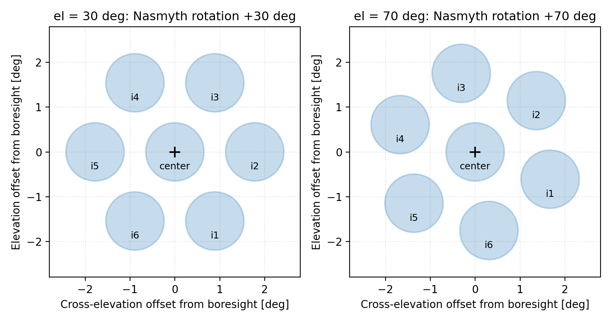

Instrument Offsets
==================

Point an off-axis detector, or a named Prime-Cam module, at a target
instead of the boresight. The boresight is offset the opposite way,
rotated by the focal plane's mechanical rotation at each sample.

Quick Example
-------------

Point a named Prime-Cam module at the target instead of the boresight::

    from astropy.time import Time

    from fyst_trajectories import get_fyst_site
    from fyst_trajectories.patterns import PongScanConfig, TrajectoryBuilder
    from fyst_trajectories.primecam import get_primecam_offset

    site = get_fyst_site()
    start_time = Time("2026-03-15T02:00:00", scale="utc")

    # Use predefined Prime-Cam offset
    offset = get_primecam_offset("i1")

    # Boresight adjusted so detector I1 tracks the target
    trajectory = (
        TrajectoryBuilder(site)
        .at(ra=180.0, dec=-30.0)
        .with_config(PongScanConfig(
            timestep=0.1, width=1.0, height=1.0, spacing=0.1,
            velocity=0.2, num_terms=4, angle=0.0,
        ))
        .for_detector(offset)
        .duration(60.0)
        .starting_at(start_time)
        .build()
    )

Focal-Plane Rotation: Mechanical and Celestial
----------------------------------------------

FYST is alt-az mounted, so the focal plane rotates as a source is
tracked, and the rotation splits in two:

.. math::

   \theta_\mathrm{mech} = s \cdot \mathrm{el} + \theta_\mathrm{inst},
   \qquad
   \theta_\mathrm{sky} = \theta_\mathrm{mech} + q,

where :math:`s` is ``nasmyth_sign``, :math:`\mathrm{el}` the elevation,
:math:`\theta_\mathrm{inst}` is ``instrument_rotation`` and :math:`q` is
the parallactic angle.

**Mechanical rotation**, :math:`\theta_\mathrm{mech}`, is the focal plane's
orientation relative to the horizon axes and needs no celestial metadata.
``nasmyth_sign`` is +1 for Right Nasmyth, -1 for Left, 0 for Cassegrain,
from ``Site.nasmyth_port`` (default ``"right"``, a port still pending
confirmation; see :ref:`index-pending-verification`);
``instrument_rotation`` is the instrument's fixed rotation relative to
the Nasmyth flange, on ``InstrumentOffset`` (default 0.0). This is the
rotation the az/el projections use (``apply_detector_offset``,
``boresight_to_detector``, ``detector_to_boresight``), identically for
celestial and AltAz patterns.

      70°; the whole layout turns by 40° between the panels.
   :width: 100%

   The mechanical rotation at work (``plot_array_footprint`` at 30° and 70°
   elevation): with no celestial input, the whole layout turns through the
   40° elevation change. Drawn for the default right Nasmyth port and the
   commissioning module geometry, both awaiting instrument-team
   confirmation (see :ref:`index-pending-verification`).

**Celestial rotation**, :math:`\theta_\mathrm{sky}`, adds the parallactic angle,
giving the orientation relative to the equatorial axes: the quantity for
sky-map orientation, image rotation and polarization angles.
``Coordinates.get_field_rotation`` returns the offset-independent form,
without ``instrument_rotation``.

``compute_focal_plane_rotation`` evaluates either frame; its
``parallactic_angle`` argument defaults to 0.0, the mechanical value::

    from fyst_trajectories import get_fyst_site, InstrumentOffset
    from fyst_trajectories.offsets import compute_focal_plane_rotation

    site = get_fyst_site()
    offset = InstrumentOffset(dx=5.0, dy=3.0, instrument_rotation=10.0)

    # Horizon-frame (mechanical) rotation - for az/el projections:
    rotation_mech = compute_focal_plane_rotation(el=45.0, site=site, offset=offset)
    # rotation_mech = +1 * 45.0 + 10.0 = 55.0

    # Celestial-frame rotation - for sky-map orientation only:
    rotation_sky = compute_focal_plane_rotation(
        el=45.0, site=site, offset=offset, parallactic_angle=20.0
    )
    # rotation_sky = +1 * 45.0 + 10.0 + 20.0 = 75.0

Point Transformations
---------------------

Where a detector lands for a given boresight, and the boresight that puts
a detector on a target. ``focal_plane_rotation`` is the **mechanical** rotation
(``compute_focal_plane_rotation`` with its default
``parallactic_angle=0.0``), not the celestial form::

    from fyst_trajectories import InstrumentOffset
    from fyst_trajectories.offsets import boresight_to_detector, detector_to_boresight

    offset = InstrumentOffset(dx=5.0, dy=3.0)  # arcmin

    det_az, det_el = boresight_to_detector(
        az=180.0, el=45.0, offset=offset, focal_plane_rotation=30.0,
    )
    bore_az, bore_el = detector_to_boresight(
        det_az=180.0, det_el=45.0, offset=offset, focal_plane_rotation=30.0,
    )

Trajectory Adjustment
---------------------

Apply the offset to a whole trajectory, with the mechanical rotation evaluated at each sample::

    from astropy.time import Time

    from fyst_trajectories import InstrumentOffset, get_fyst_site
    from fyst_trajectories.offsets import apply_detector_offset
    from fyst_trajectories.patterns import PongScanConfig, TrajectoryBuilder

    site = get_fyst_site()
    start_time = Time("2026-03-15T02:00:00", scale="utc")

    trajectory = (
        TrajectoryBuilder(site)
        .at(ra=180.0, dec=-30.0)
        .with_config(PongScanConfig(
            timestep=0.1, width=1.0, height=1.0, spacing=0.1,
            velocity=0.2, num_terms=4, angle=0.0,
        ))
        .duration(60.0)
        .starting_at(start_time)
        .build()
    )

    offset = InstrumentOffset(dx=30.0, dy=0.0)
    adjusted = apply_detector_offset(trajectory, offset, site=site)

Prime-Cam Offsets
-----------------

Predefined offsets for the Prime-Cam focal plane
(:func:`~fyst_trajectories.visualization.plot_array_footprint` draws
this layout, and ``primecam_geometry_dict()`` exports it as a
scheduler geometry schema):

**Center**: ``get_primecam_offset("c")`` or ``PRIMECAM_CENTER`` - at boresight (0, 0)

**Inner Ring** (1.78° = 106.8 arcmin from center):

+------------+----------------+----------------+
| Name       | dx (arcmin)    | dy (arcmin)    |
+============+================+================+
| i1         | 0.0            | -106.8         |
+------------+----------------+----------------+
| i2         | 92.5           | -53.4          |
+------------+----------------+----------------+
| i3         | 92.5           | 53.4           |
+------------+----------------+----------------+
| i4         | 0.0            | 106.8          |
+------------+----------------+----------------+
| i5         | -92.5          | 53.4           |
+------------+----------------+----------------+
| i6         | -92.5          | -53.4          |
+------------+----------------+----------------+

.. note::

   These positions are derived from the default plate scale (13.89 arcsec/mm)
   and inner-ring radius (461.3 mm), both commissioning-era defaults awaiting
   FYST instrument-team confirmation. Every off-axis offset scales linearly
   with both, so a revision to either shifts the whole inner ring. See
   :ref:`index-pending-verification` for the full list.

   The offset math is exact spherical trigonometry at any radius, but
   numerical accuracy is not pointing performance: FYST's offset-pointing
   error is specified (requirements document P-TSSS-RQT-0001-G) only up
   to a 25° radial offset, for a time period after calibration of one
   minute, and over 30° to 85° elevation, so treat large offsets as a
   library capability rather than a telescope pointing guarantee.

**Module naming**

The names ``c`` and ``i1`` .. ``i6`` label *positions* on the focal plane:
one on-axis position and six inner-ring positions. They are not identities
of the instrument modules that occupy them. Which observing band is
installed at which position is deployment configuration, tracked by the
observatory, and deliberately not modelled by this library.

The Prime-Cam instrument team designates the same positions ``IM0``
(on-axis) through ``IM6`` (inner ring); see Fig. 1 of Keller et al. 2026,
"CCAT: Design and Characterization of the 350 GHz Instrument Module",
arXiv:2608.05121, for the first four planned modules, where the
figure writes them ``Im0`` .. ``Im6``. Module names resolve
case-insensitively here, so the casing is a spelling difference only. The
two schemes do **not** correspond index-for-index: on sky, they number the
ring in opposite senses, so ``i1`` must not be translated to ``IM1``. The
correspondence is pending confirmation against the as-built focal plane
(see :ref:`index-pending-verification`), after which the library plans to
adopt the ``IM`` designations (see :doc:`changelog`). Today, ``IM0`` is
accepted anywhere a module name is (an alias for the on-axis ``c``, the one
mirror-invariant position); ``IM1`` .. ``IM6`` are rejected until the
confirmation lands.

**Access**::

    from fyst_trajectories.primecam import (
        PRIMECAM_I1,
        PRIMECAM_MODULES,
        get_primecam_offset,
        resolve_offset,
    )

    offset = get_primecam_offset("i1")  # Case-insensitive
    offset = PRIMECAM_I1                # Direct access

    for name, offset in PRIMECAM_MODULES.items():
        print(f"{name}: dx={offset.dx:.1f}', dy={offset.dy:.1f}'")
        # c: dx=0.0', dy=0.0'
        # center: dx=0.0', dy=0.0'
        # i1: dx=0.0', dy=-106.8'
        # i2: dx=92.5', dy=-53.4'
        # i3: dx=92.5', dy=53.4'
        # i4: dx=0.0', dy=106.8'
        # i5: dx=-92.5', dy=53.4'
        # i6: dx=-92.5', dy=-53.4'

``resolve_offset`` is the entry point when the offset comes from user
input (CLI, config file, API request): it handles all three cases in one
call, named module, custom dx/dy, or boresight (``None``)::

    from fyst_trajectories.primecam import resolve_offset

    # Named module -> predefined InstrumentOffset
    offset = resolve_offset(module="i1")

    # Custom angular offset (arcmin)
    offset = resolve_offset(dx=10.0, dy=5.0, name="my-detector")

    # dx only; dy defaults to 0.0
    offset = resolve_offset(dx=10.0)

    # No arguments -> None (boresight pointing)
    offset = resolve_offset()

``resolve_module_tag`` expands a comma-separated module tag (``"i1,i2"``,
a list of names, or ``"all"``) into a ``list[InstrumentOffset]``. Pass it
straight to ``plan_source_ces(footprint=...)`` to point the centroid of
the selected modules at a source::

    from astropy.time import Time

    from fyst_trajectories import get_fyst_site
    from fyst_trajectories.planning import plan_source_ces
    from fyst_trajectories.primecam import resolve_module_tag

    block = plan_source_ces(
        body="jupiter",
        footprint=resolve_module_tag("i1,i2"),  # centroid of I1+I2 on Jupiter
        el_bore=35.0,
        night=Time("2026-03-15T00:00:00", scale="utc"),
        mode="rising",
        site=get_fyst_site(),
    )

Custom Offsets
--------------

**From angular offsets (arcminutes)**::

    from fyst_trajectories import InstrumentOffset

    offset = InstrumentOffset(dx=10.0, dy=5.0, name="MyDetector")

    # Values are in arcminutes; properties provide degrees
    print(f"{offset.dx_deg:.4f} x {offset.dy_deg:.4f} degrees")  # 0.1667 x 0.0833 degrees

    # With instrument rotation (e.g., dewar rotated 15 degrees)
    offset = InstrumentOffset(
        dx=10.0, dy=5.0, name="RotatedDetector", instrument_rotation=15.0
    )

**From physical focal plane coordinates (millimeters)**::

    from fyst_trajectories import InstrumentOffset, get_fyst_site

    site = get_fyst_site()

    # Convert physical position to angular offset using plate scale
    offset = InstrumentOffset.from_focal_plane(
        x_mm=399.5,            # Cross-elevation position (mm)
        y_mm=-230.65,          # Elevation position (mm)
        plate_scale=site.plate_scale,  # 13.89 arcsec/mm
        name="i2-position",
    )
    print(f"Angular offset: {offset.dx:.1f}' x {offset.dy:.1f}'")
    # Angular offset: 92.5' x -53.4'

    # With instrument rotation (e.g., dewar at 15 degree angle)
    offset = InstrumentOffset.from_focal_plane(
        x_mm=100.0, y_mm=200.0,
        plate_scale=site.plate_scale,
        name="RotatedModule",
        instrument_rotation=15.0,
    )
