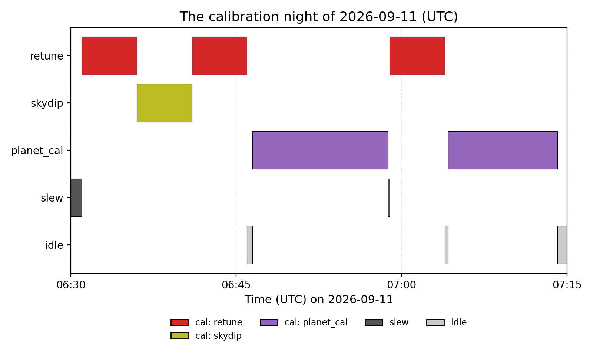

Calibration Nights
==================

:func:`~fyst_trajectories.overhead.plan_calibration_night` lays out one
night of solar-system calibration passes back to back: it walks the
night, picks whichever planet is up next, plans each visit with the
source-CES kernel (see :doc:`planning`), which solves each pass's azimuth
throw from the footprint, checks the slew between visits for Sun safety,
reserves the detector operations before each visit, and returns an
ordinary
:class:`~fyst_trajectories.overhead.ObservingTimeline`. It is an offline
planning tool for commissioning nights, a sibling of the survey-night
simulator :func:`~fyst_trajectories.overhead.generate_timeline` that
shares its block model and outputs but walks a body queue instead of a
cadence loop.

Quick Start
-----------

Plan 45 minutes of a night and read it back::

    from fyst_trajectories import get_fyst_site
    from fyst_trajectories.overhead import (
        dispatch_sheet,
        plan_calibration_night,
        summarize_calibration_night,
    )

    site = get_fyst_site()
    timeline = plan_calibration_night(
        ["saturn", "uranus"],          # priority order
        site,
        "2026-09-11T06:30:00",         # the window is clipped to when the Sun is down
        "2026-09-11T07:15:00",
    )

    summary = summarize_calibration_night(timeline)
    print(summary.bodies[0].passes, summary.bodies[1].passes)
    # 2 0

    row = next(line for line in dispatch_sheet(timeline).splitlines() if "source_scan" in line)
    print(row[:53])
    #      6  2026-09-11 06:46:28     12.3 min  source_scan

      retunes and a skydip, and two Saturn passes separated by a retune.
   :width: 100%

   The night above as ``plot_timeline_gantt`` draws it: the detector
   operations before each visit, then each pass after its short
   ``waiting_for_pass`` idle.

The summary carries each body's visits, passes, minutes on source, duty
cycle and geometry; the sheet has one numbered row per block, and the
pass rows carry the literal ``scan_params`` dict for the execution
layer's source-scan task. Beside the base keys that dict carries the
focal-plane row the pass is planned on (``eta_offset_deg``, 0 on a
single-pass visit) and the geometry the visit asked for: ``az_speed`` and
``az_accel`` always; ``az_padding`` of 0 when the pass sweeps the throw
solved from the footprint, the default, or ``az_throw`` in its place when
the table (under ``use_table_throw``) or a per-visit override sets the
throw; and ``dwell`` or ``footprint_margin`` when the table, the policy or
a per-visit override sets them. The source-scan task, at the revision
this library is checked against, reads ``az_accel`` and ``az_padding``
but not ``az_speed``, ``eta_offset_deg``, ``az_throw``, ``dwell`` or
``footprint_margin``: it drops those without a message and plans the pass
from its own defaults. A pass row whose dict carries any of them ends with
a note naming the ones it carries; confirm the receiving task forwards
them before dispatching. Every pass dict carries ``az_speed`` and
``eta_offset_deg``, so every pass row has the note::

    notes = {line.strip() for line in dispatch_sheet(timeline).splitlines() if "note:" in line}
    print(notes)
    # {'note: confirm the execution layer forwards az_speed, eta_offset_deg'}

Both views are rendered from the timeline's blocks and metadata, so a
sheet printed from a timeline read back from ECSV is byte-identical.

For complete runnable scripts, see ``examples/planet_night.py`` (a night
with its summary, dispatch sheet, ECSV and figures) and
``examples/planet_speed_sweep.py`` (a scripted speed sweep on one body)
in the repository.

Scan Tables and Policy
----------------------

Each body has an elevation-binned table of reference scan geometry: an
azimuth throw for each bin, swept only when the policy's
``use_table_throw`` asks for it, and a reference dwell, the table's scan
time, applied only when ``use_table_dwell`` asks for it. By default a pass
sweeps the throw the kernel solves from the footprint instead: one module
width, plus ``footprint_margin`` on each side, over the cosine of the pass
elevation. The shipped tables are instrument-team commissioning defaults;
a body without its own table uses ``"default"``, and above a table's top
bin the throw is extrapolated at constant on-sky width::

    from fyst_trajectories.overhead import DEFAULT_SCAN_TABLES

    shared = DEFAULT_SCAN_TABLES["default"]
    print(shared.el_range, shared.bins[0].az_throw, shared.bins[0].dwell_reference)
    # (30.0, 50.0) 2.44 600.0
    print(f"{shared.az_throw_at(62.0):.2f}")
    # 4.48

Your own table replaces the defaults without a release. The loader reads a
CSV with a body column, the bin bounds, the scan time in minutes and the
scan width in degrees of azimuth::

    from pathlib import Path

    from fyst_trajectories.overhead import load_scan_tables

    Path("tables.csv").write_text(
        "body,el_lo,el_hi,scan_time_min,az_throw\n"
        "default,30,40,10,2.5\n"
        "default,40,50,13,2.9\n"
        "uranus,30,40,15,2.5\n"
    )
    tables = load_scan_tables("tables.csv")
    print(sorted(tables), tables["uranus"].el_range)
    # ['default', 'uranus'] (30.0, 40.0)

Beside the throw, the sweep speed and acceleration shape a pass; they
come from the
:class:`~fyst_trajectories.overhead.CalibrationNightPolicy` (1.5 deg/s
and 1.0 deg/s² by default), and the dwell is solved from the footprint
crossing unless the policy applies the table's reference or a visit
overrides it. The policy also holds the observing floor (30°), the
longest crossing accepted (20 min), the footprint and the on-sky margin
around it (``footprint_margin``, which a rebuild has to re-apply to land
on the same crossing), the idle tick and the retry interval, and the tuning policy
for the detector operations. The quintic turnaround peaks at 1.5 times
the nominal acceleration, so the default 1.0 deg/s² peaks at the site's
1.5 deg/s² advisory ceiling and a default night records no acceleration
advisory. The first pass of the night above sweeps 2.72°, one module width
over the cosine of its 61.5° elevation::

    first = next(b for b in timeline.blocks if b.scan_type == "planet_cal")
    print(f"{first.metadata['applied']['az_throw']:.2f} {first.elevation:.1f}")
    # 2.72 61.5
    print(any("acceleration" in w for w in summary.warnings))
    # False

That leg spends about 38 percent of its samples in science at those
defaults (the rest in turnarounds); a wider throw spends more, and the
``science_fraction`` recorded on every pass block reports the actual
figure.

Selection Rules
---------------

The default rule visits the first available body in the caller's order.
A :class:`~fyst_trajectories.overhead.ScriptedSelection` walks a fixed list
of entries instead, each with optional per-visit
:class:`~fyst_trajectories.overhead.ScanOverrides`; consecutive entries on
one body chain back to back, which is how a parameter sweep is written::

    from fyst_trajectories.overhead import ScanOverrides, ScriptedSelection

    sweep = ScriptedSelection(
        [("saturn", ScanOverrides(az_speed=v)) for v in (0.5, 1.0, 1.5)]
    )
    swept = plan_calibration_night(
        ["saturn"], site, "2026-09-11T06:30:00", "2026-09-11T07:30:00", selection=sweep
    )
    passes = [b for b in swept.blocks if b.scan_type == "planet_cal"]
    print([b.metadata["applied"]["az_speed"] for b in passes])
    # [0.5, 1.0, 1.5]

An entry whose body is not available waits up to the policy's
``max_wait_seconds`` and is then set aside; the summary lists such
unplaced entries. Any callable with the
:class:`~fyst_trajectories.overhead.SelectionRule` signature is accepted.

Stepping Through a Night by Hand
--------------------------------

The driver loops over four public functions,
:func:`~fyst_trajectories.overhead.list_candidates`,
:func:`~fyst_trajectories.overhead.plan_visit`,
:func:`~fyst_trajectories.overhead.commit_visit` and
:func:`~fyst_trajectories.overhead.advance_idle`, and a person at an
interactive session can call them directly to plan a visit, inspect it,
discard it and re-plan with other overrides. Time comes from the state,
never from a clock, so a night planned twice is identical::

    from fyst_trajectories.overhead import (
        NightContext,
        NightState,
        commit_visit,
        list_candidates,
        plan_visit,
    )

    ctx = NightContext.build(["saturn", "uranus"], site, "2026-09-11T06:30:00", "2026-09-11T08:00:00")
    state = NightState.initial(ctx.start_time)

    candidates = list_candidates(state, ctx)
    print([(c.body, c.available, round(c.el_bore_estimate, 1)) for c in candidates])
    # [('saturn', True, 62.2), ('uranus', True, 31.3)]

    plan = plan_visit(state, ctx, "saturn", ScanOverrides(az_speed=1.0))
    print(plan.feasible, plan.transition.path, [b.scan_type for b in plan.blocks])
    # True direct ['slew', 'retune', 'skydip', 'retune', 'idle', 'planet_cal']

    state = commit_visit(state, plan)
    print(round((state.t - ctx.start_time).to_value("s") / 60.0, 1))
    # 28.7

An infeasible visit is returned, never raised: ``plan.reason`` names why
(the kernel could not plan the anchor, below or above the band, the
crossing too slow, no whole pass left before the night ends, the retune
pose, a pass or the wait before a later pass inside the Sun zone, no
sun-safe slew or step between passes, no azimuth wrap, the goal outside
the axis limits, or no way out of the zone), and
``commit_visit`` records a deferral or, for the two geometry reasons (no
wrap and the axis limits), a drop for the night. A telescope the Sun zone has
overtaken while it sat still is moved out first, by ``plan_visit`` and
``advance_idle`` alike (:func:`~fyst_trajectories.overhead.plan_escape`;
a slew named ``sun_escape`` leads the blocks and the pass records the
pose it escaped to). The night's first ``retune`` block stands for the
detector-finding operation, named in ``metadata["operation"]``, and a
skydip is reserved whenever the calibration policy's cadence says one is
due.

What a Pass Block Carries
-------------------------

Each pass is a ``planet_cal`` calibration block whose ``scan_params`` is
a relative dispatch dict (body, module, mode, boresight elevation, the
geometry and override keys, never an absolute window), alongside the pass
anchor ``t0_scan``, the instant the kernel's search for the pass began
(``search_start``, the two parts ``[jd1, jd2]`` of its UTC Julian date,
which read back from ECSV unchanged), three geometry records
(``requested``, ``applied`` and ``solved``), the science fraction, the
number of legs, the fraction of the pass each module saw the source
(``module_crossings``) and the transition that preceded it. The dict's
``footprint`` is the module's canonical name, ``"c"`` or ``"i1"`` ..
``"i6"``, whichever spelling the policy used (``"IM0"`` and ``"Center"``
are recorded as ``"c"``), since the execution layer compares it as a
string. Every pass rebuilds from its block, and the track of the source
across the focal plane can be drawn. Rebuilding re-runs the kernel over the
search the planner made, the 24 hours from ``search_start``, so the rebuilt
pass is the planned one sample for sample, its solved throw included. A
pass block without ``search_start`` is re-solved instead in a window of its
pass widened by 300 s on each side. That lands within about 0.1 s of the
planned start and solves the throw again to about 1e-4°, the solver's
tolerance, but skips the pass when the window misses the source's crossing
of the boresight elevation (an off-centre module) or part of its crossing
of the footprint (a dwell that cuts about 300 s or more from it). At this
elevation the on-sky azimuth speed advisory is raised as a warning rather
than recorded::

    from fyst_trajectories.overhead import schedule_to_trajectories
    from fyst_trajectories.visualization import plot_source_track, plot_timeline_gantt

    pairs = schedule_to_trajectories(timeline, science_only=False)
    print(len(pairs), sorted(pairs[0][0].metadata["solved"]))
    # 2 ['az_throw', 'crossing_seconds']

    fig = plot_timeline_gantt(timeline, show=False)
    fig.savefig("calibration_night.png", dpi=120)
    fig = plot_source_track(pairs[0][1], site=site, show=False)
    fig.savefig("first_pass_track.png", dpi=120)

Lateness
--------

A pass can absorb only the slack the plan left in front of it: the
``waiting_for_pass`` idle that runs from the end of the detector operations
to ``t0_scan``. The kernel's anchor lead sets that idle, so it is usually
tens of seconds; the sheet prints the figure on each pass row, and the idle
itself is a row of its own, so read the night's own number there rather than
assuming a fixed one. Once ``t0_scan`` has passed the crossing has opened
without the telescope on it, and re-planning the recorded dict from a later
anchor raises
:class:`~fyst_trajectories.exceptions.TargetNotObservableError` rather than
returning a shifted pass: re-plan the next block from now with
``plan_visit`` on a state whose time is the actual time and whose
``cal_state`` records the detector operations already done, because
:meth:`~fyst_trajectories.overhead.NightState.initial` records none and a
fresh state reserves the detector-finding operation and a skydip again.

:meth:`~fyst_trajectories.overhead.NightContext.from_timeline` rebuilds the
night's context from its timeline, in memory or read back from ECSV, and
:meth:`~fyst_trajectories.overhead.NightState.from_timeline` replays the
blocks that ended by a given time into such a state, with the deferrals and
drops recorded by then; a scripted night is given its own
:class:`~fyst_trajectories.overhead.ScriptedSelection` to restore its place
in the script. The replay credits every block as recorded, so it assumes the
night ran as planned up to that time. The record names the Sun predicates
without holding them, so a night planned on another model is resumed with
that model passed in again; a predicate that does not match the record is
refused, as is a site whose axis limits differ from those the night was
planned on. A record written before the policy had ``use_table_throw`` is
read with it set, since that night swept the table's throw. Here the first
pass's crossing opened a minute before the operator was ready::

    from astropy.time import TimeDelta

    from fyst_trajectories.overhead import read_timeline, write_timeline

    write_timeline(timeline, "night.ecsv")
    saved = read_timeline("night.ecsv")
    ctx = NightContext.from_timeline(saved)

    first_pass = next(b for b in saved.blocks if b.scan_type == "planet_cal")
    state = NightState.from_timeline(saved, first_pass.t_start + TimeDelta(60.0, format="sec"))
    print(len(state.blocks), state.cal_state.last_skydip is not None)
    # 5 True

    plan = plan_visit(state, ctx, "saturn")
    print(plan.feasible, [b.scan_type for b in plan.blocks])
    # True ['slew', 'retune', 'idle', 'planet_cal']

The five blocks before the pass count as done, the detector-finding
operation and the skydip among them, so the re-planned visit reserves only
the retune before its pass.
