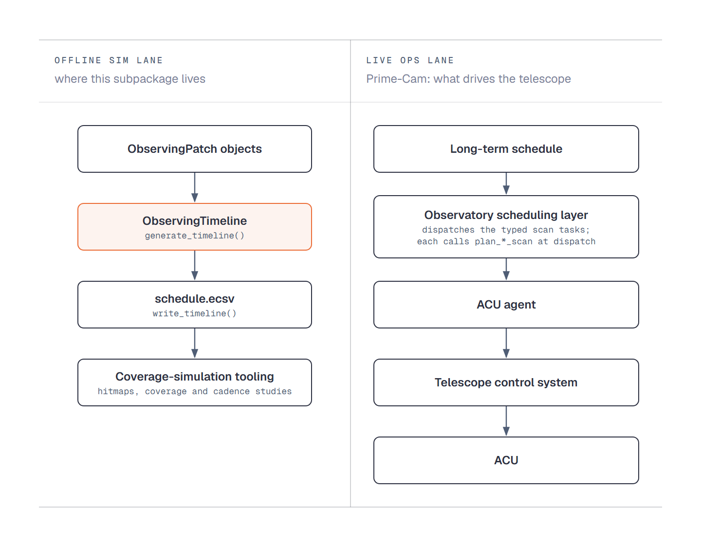

Offline Simulation and Live Operations
======================================

The ``overhead`` subpackage is a **planning-time simulator**. It produces
a realistic minute-by-minute observing night for survey design, and
plans calibration nights for commissioning; it never drives a telescope.
This page places that lane beside the live one and says who owns each
category of input.

FYST hosts two instrument pipelines, Prime-Cam on Simons
Observatory-derived control software and CHAI on the KOSMA stack. This
library serves the Prime-Cam lane, and the framing below is written for
it.

Where the Subpackage Fits
-------------------------

The subpackage feeds the offline lane; live operations run a separate
path. Its input is a list of :class:`~fyst_trajectories.overhead.ObservingPatch`
objects built in Python, by hand or from a source list, as the
repository's ``examples/overhead_from_csv.py`` does with
``examples/sample_sourcelist.csv``.

      ObservingTimeline, write_timeline() to schedule.ecsv, then coverage-simulation
      tooling. Live, for Prime-Cam: long-term schedule, observatory scheduling layer
      dispatching the typed scan tasks, ACU agent, telescope control system, ACU.
   :width: 100%

   The offline simulation lane, where this subpackage lives, beside the
   live Prime-Cam lane that drives the telescope.

fyst-trajectories sits *underneath* both lanes: the core library is
imported in both, the ``overhead`` subpackage only in the sim lane, where
the diagram's hitmap accumulation is
:func:`~fyst_trajectories.overhead.accumulate_hitmaps` (the ``overhead``
extra supplies its ``healpy`` dependency).

**Planning = execution, within fyst-trajectories.** The same
``plan_*_scan`` functions are called by ``overhead.generate_timeline``
(sim lane) and by the live typed scan tasks (ops lane), so the geometry
of a rebuilt block is the geometry a dispatch of the same parameters
would execute. A pong science block holds a whole number of pattern
periods and records the count as ``n_cycles``, so its length is what a
dispatch of the same ``n_cycles`` runs. This is not, however, a contract
between the overhead-emitted ECSV and live execution: the ECSV is a sim
artifact, not the schedule the telescope reads.

**Retunes are planning-side only.** Nothing on the live path reads the
sample-level retune flags: the ``/path`` payload carries positions and
velocities only, and
:func:`~fyst_trajectories.overhead.schedule_to_trajectories` never calls
:func:`~fyst_trajectories.retune.inject_retune` when it rebuilds
a block.

**One output is dispatched by hand.**
:func:`~fyst_trajectories.overhead.plan_calibration_night` plans a
commissioning night whose dispatch sheet carries, on each pass row, the
``scan_params`` dict for the execution layer's source-scan task. An
operator dispatches those rows (see :doc:`overhead_calibration_night`);
nothing in the library dispatches them, and a survey night from
:func:`~fyst_trajectories.overhead.generate_timeline` has no such rows.

Parameter Ownership
-------------------

Four categories of input shape the outputs. Each has a natural owner; a
user should not be guessing at values they do not control.

.. list-table::
   :header-rows: 1
   :widths: 25 25 50

   * - Input
     - Natural owner
     - Examples
   * - **Layer 1 (in-scan)**: detector timing
     - Prime-Cam / instrument team
     - ``retune_interval``, ``retune_duration``, ``n_modules``. These
       describe KID thermal drift and readout wall-time, not astronomy,
       and parameterize
       :func:`~fyst_trajectories.retune.inject_retune` on a
       single trajectory rather than the timeline. The timeline's own
       ``OverheadModel.retune_duration`` has the same owner; see
       :doc:`overhead_model` for how the two differ.
   * - **Layer 2 (block-level)**: calibration cadences and activity durations
     - Operations / commissioning team
     - ``CalibrationPolicy`` cadences and ``OverheadModel`` durations,
       excepting the retune fields (``retune_cadence``,
       ``retune_duration``), which stay with Layer 1's owner. Reflect
       site atmosphere, telescope settling, and calibration strategy, not
       per-proposal knobs.
   * - **Calibration nights**: scan tables and sweep policy
     - Prime-Cam / instrument team, with operations
     - ``DEFAULT_SCAN_TABLES`` reference throws and scan times (swept only when the policy's
       ``use_table_throw`` or ``use_table_dwell`` asks), ``CalibrationNightPolicy`` sweep speed
       and acceleration, ``TuningPolicy.find_detectors_duration``. These shape the passes an
       operator dispatches (see :doc:`overhead_calibration_night`).
   * - **Per-proposal**: what to observe
     - Astronomer
     - ``ObservingPatch`` geometry, ``scan_type``, ``velocity``,
       ``elevation`` (for constant-el scans), time window.

:func:`~fyst_trajectories.overhead.generate_timeline` accepts bare
``OverheadModel()`` / ``CalibrationPolicy()`` defaults, but relying on those
hides physical assumptions and should be avoided outside of quick
exploratory scripts.

See also
--------

* :doc:`overhead_quickstart` - the minimal working example.
* :doc:`planning` - the ``plan_*_scan`` functions both lanes call.
* :ref:`planet-cal-source-ces` - planet calibrations as real
  source-CES passes, reconstructable from the timeline.
