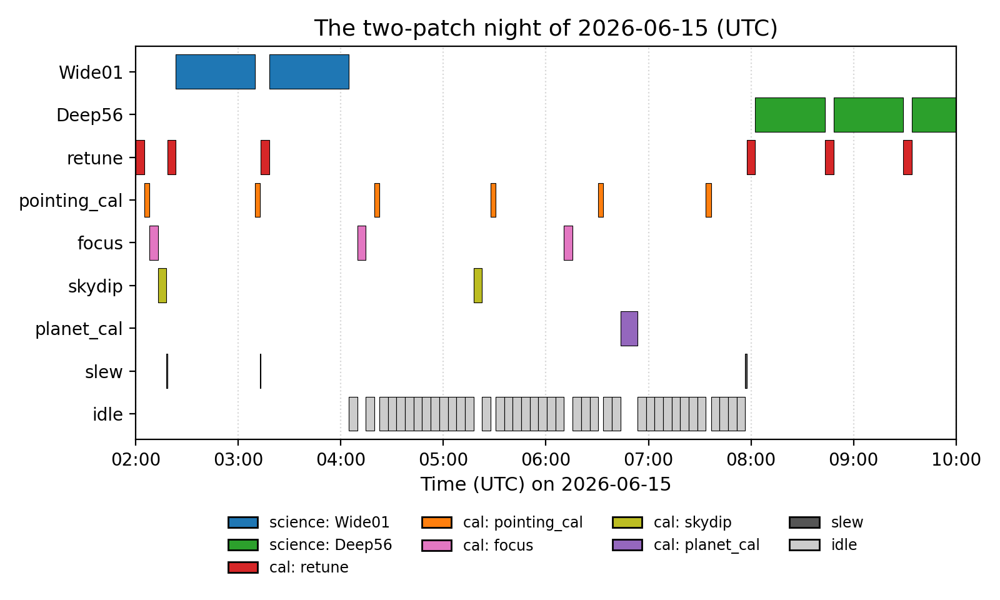

Simulator Quickstart
====================

``fyst_trajectories.overhead`` simulates an observing night offline:
science scans, calibrations, slews and idle time, minute by minute, for
survey design. This page runs one night end to end.

Basic Usage
-----------

Generate an 8-hour observing timeline with 2 patches. ``overhead_model``
and ``calibration_policy`` are optional; this night omits both and runs on
the defaults, which :doc:`overhead_model` lists field by field.
::

    from fyst_trajectories import get_fyst_site
    from fyst_trajectories.overhead import (
        ObservingPatch,
        compute_budget,
        generate_timeline,
    )

    site = get_fyst_site()

    patches = [
        ObservingPatch(
            name="Deep56",
            ra_center=24.0,
            dec_center=-32.0,
            width=40.0,
            height=10.0,
            scan_type="constant_el",
            velocity=1.0,
            elevation=50.0,
        ),
        ObservingPatch(
            name="Wide01",
            ra_center=180.0,
            dec_center=-30.0,
            width=4.0,
            height=4.0,
            scan_type="pong",
            velocity=0.5,
        ),
    ]

    timeline = generate_timeline(
        patches=patches,
        site=site,
        start_time="2026-06-15T02:00:00",
        end_time="2026-06-15T10:00:00",
    )

    print(f"{len(timeline)} blocks scheduled")  # 65 blocks scheduled

      per patch and per calibration type plus slew and idle lanes.
   :width: 100%

   This night as ``plot_timeline_gantt`` draws it: Wide01's Pong scans
   early, Deep56's constant-elevation scans once its crossing opens,
   calibrations on their cadences in between, and idle ticks while no
   patch is observable.

``generate_timeline`` takes three more keyword arguments:

* ``sun_safe=`` selects the Sun-avoidance policy the night is simulated
  under; the default is the site's scalar exclusion radius (see
  :doc:`sun_avoidance`).
* ``constraints=`` replaces the default patch-selection constraints
  (elevation and Sun) with an explicit list built from
  :class:`~fyst_trajectories.overhead.ElevationConstraint`,
  :class:`~fyst_trajectories.overhead.SunAvoidanceConstraint`,
  :class:`~fyst_trajectories.overhead.MoonAvoidanceConstraint`,
  :class:`~fyst_trajectories.overhead.MinDurationConstraint`, or a custom
  :class:`~fyst_trajectories.overhead.Constraint`. The list is used as
  given, so ``sun_safe`` then no longer drives patch selection; it still
  drives the mid-scan duration clips, the slew gate, the escape move and
  the scan-mode planet calibrations.
* ``time_step=`` sets the scheduler tick in seconds (default 300): how
  far the clock advances when nothing can be scheduled, and (plus a slew
  allowance) the look-ahead for a constant-elevation pass.

See :doc:`api/overhead_timeline` for the full signature.

Efficiency Statistics
---------------------

:func:`~fyst_trajectories.overhead.compute_budget` provides a summary::

    stats = compute_budget(timeline)
    print(f"Efficiency: {stats['efficiency']:.1%}")  # Efficiency: 41.7%
    print(f"Science:     {stats['science_time'] / 3600:.1f}h")  # Science: 3.3h

:doc:`overhead_timeline` walks the full breakdown, including the
per-patch and per-calibration-type entries.

Saving a Timeline
------------------

Write to TOAST-compatible ECSV and read it back::

    from fyst_trajectories.overhead import write_timeline, read_timeline

    write_timeline(timeline, "my_timeline.ecsv")
    loaded = read_timeline("my_timeline.ecsv")
    print(f"Loaded {len(loaded)} blocks")  # Loaded 65 blocks

See :doc:`overhead_io` for format details and TOAST compatibility.

For a complete runnable script that reads patches from a source-list CSV
and walks this whole path (build, generate, write, read back, summarise),
see ``examples/overhead_from_csv.py`` in the repository.
