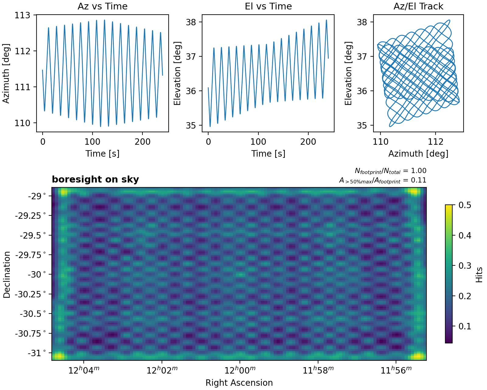
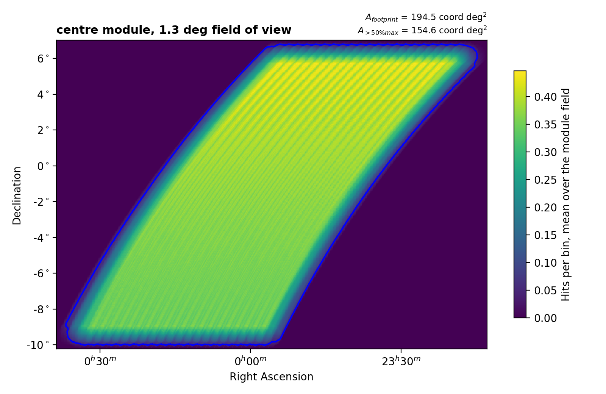
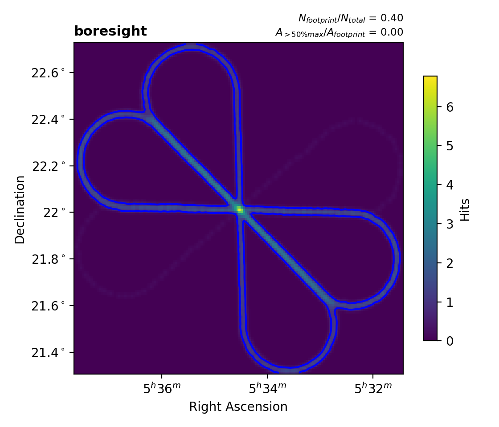
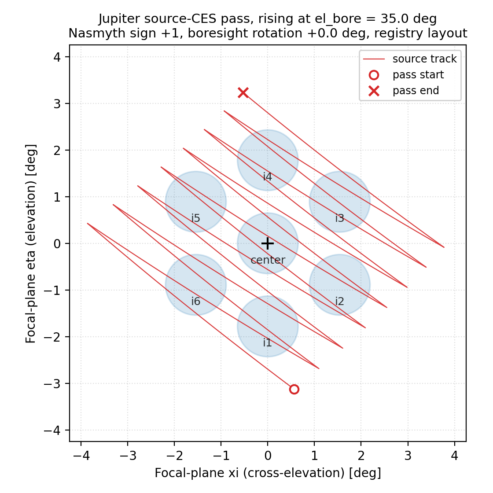

Planning Module
===============

The planners turn an astronomer's description of a scan (a field or a
source, an elevation, a speed) into pattern parameters and, for most, a
built trajectory returned in a
:class:`~fyst_trajectories.planning.ScanBlock`. Sequencing scans across a
night belongs to the scheduler; the offline simulator
(:doc:`overhead_quickstart`) models it for planning studies.

Quick Start
-----------

Plan a Pong survey scan over a 2° × 2° field::

    from astropy.time import Time

    from fyst_trajectories import get_fyst_site
    from fyst_trajectories.planning import FieldRegion, plan_pong_scan

    site = get_fyst_site()

    field = FieldRegion(ra_center=180.0, dec_center=-30.0, width=2.0, height=2.0)
    block = plan_pong_scan(
        field=field,
        velocity=0.4,        # deg/s
        spacing=0.1,         # deg between scan lines
        num_terms=4,         # Fourier terms for smooth turnarounds
        site=site,
        start_time=Time("2026-03-15T01:00:00", scale="utc"),
        timestep=0.1,
    )

    print(block.summary)
    print(f"Duration: {block.duration:.1f}s ({block.duration / 3600:.1f}h)")
    print(f"Trajectory: {block.trajectory.n_points} points")

      elevation against time, and the az/el track, a raster turned relative
      to the horizon axes. Below, the boresight's hit density in right
      ascension and declination: the whole field covered, in a fine lattice
      of denser and sparser spots, brighter along its edges and brightest in
      its corners.
   :width: 100%

   The block above: one Pong period over the 2° × 2° field. Azimuth and
   elevation oscillate together, and the raster is turned relative to the
   horizon axes because the field is laid out in RA and Dec. On sky
   (``plot_hit_map``, boresight hits lightly smoothed) the same period
   covers the whole field, in a fine lattice of denser and sparser spots,
   with extra hits along the edges and in the corners, where the pattern
   turns around.

A planning function wraps each scan type an astronomer specifies by sky
geometry; how much it computes between those inputs and the pattern config
varies:

- **Pong** - computes the Pong period from field dimensions, spacing, and
  velocity.
- **Constant-El** - derives the timing, azimuth range and ``n_scans`` from
  an elevation crossing or a Local Sidereal Angle window.
- **Daisy** - convenience wrapper; parameters map nearly 1:1 to the config.
- **Source CES** - drags a moving source across an instrument-array
  footprint at fixed boresight elevation.
- **AltAz Pong / Daisy** - run the Pong and Daisy patterns about a fixed
  horizon-frame center (no RA/Dec tracking).

Sidereal, planet, satellite, and linear patterns have no non-trivial planning
step; use :class:`~fyst_trajectories.patterns.TrajectoryBuilder` directly.

Field Regions
-------------

A :class:`~fyst_trajectories.planning.FieldRegion` defines a rectangular sky area
by its center coordinates and angular extent::

    from fyst_trajectories.planning import FieldRegion

    field = FieldRegion(
        ra_center=0.0,     # deg
        dec_center=-2.0,   # deg
        width=10.0,        # on-sky angular width in degrees, not the RA span
        height=6.0,        # Dec extent in degrees
    )

    # Dec boundaries are computed automatically
    print(f"Dec range: [{field.dec_min}, {field.dec_max}]")
    # Dec range: [-5.0, 1.0]

Planning a Pong Scan
--------------------

:func:`~fyst_trajectories.planning.plan_pong_scan` converts a field region into a
Pong scan trajectory, generating one full Pong period by default. Beyond
the Quick Start call it takes a pattern rotation and a cycle count::

    from astropy.time import Time

    from fyst_trajectories import get_fyst_site
    from fyst_trajectories.planning import FieldRegion, plan_pong_scan

    site = get_fyst_site()

    field = FieldRegion(ra_center=53.117, dec_center=-27.808, width=5.0, height=6.7)
    block = plan_pong_scan(
        field=field,
        velocity=0.5,
        spacing=0.08,
        num_terms=4,
        site=site,
        start_time=Time("2026-03-15T23:30:00", scale="utc"),
        timestep=0.1,
        angle=170.0,     # rotation angle (degrees)
        n_cycles=3,      # observe 3 full Pong periods
    )

``detector_offset`` shifts the boresight so an off-axis Prime-Cam module
tracks the field::

    from fyst_trajectories.primecam import get_primecam_offset

    block = plan_pong_scan(
        field=field, velocity=0.5, spacing=0.1, num_terms=4, site=site,
        start_time=Time("2026-03-15T01:00:00", scale="utc"), timestep=0.1,
        detector_offset=get_primecam_offset("i1"),
    )

Multi-Rotation Pong Tiling
--------------------------

:func:`~fyst_trajectories.planning.plan_pong_rotation_scans` plans
``n_rotations`` Pong scans of one field at the angles
``i * 180 / n_rotations`` (the pattern is invariant under a 180° rotation),
back to back from ``start_time``: each rotation starts when the one before
it ends. Every other keyword goes to
:func:`~fyst_trajectories.planning.plan_pong_scan`::

    from astropy.time import Time

    from fyst_trajectories import get_fyst_site
    from fyst_trajectories.planning import FieldRegion, plan_pong_rotation_scans

    site = get_fyst_site()
    field = FieldRegion(ra_center=180.0, dec_center=-30.0, width=2.0, height=2.0)
    blocks = plan_pong_rotation_scans(
        field,
        n_rotations=4,
        start_time=Time("2026-03-15T01:00:00", scale="utc"),
        velocity=0.3,
        spacing=0.1,
        site=site,
    )
    for block in blocks:
        print(block.config.angle, block.trajectory.start_time.isot)
    # 0.0 2026-03-15T01:00:00.000
    # 45.0 2026-03-15T01:05:20.000
    # 90.0 2026-03-15T01:10:40.000
    # 135.0 2026-03-15T01:16:00.000

The blocks are a plan: consecutive rotations meet in time and position, but
the direction of motion changes at each boundary, so each block is a
separate scan, and a dispatcher re-plans each rotation at its own dispatch
time.

For the builder path,
:func:`~fyst_trajectories.planning.plan_pong_rotation_sequence` returns
``n_rotations`` copies of a base
:class:`~fyst_trajectories.patterns.PongScanConfig` with the ``angle``
field overridden to the same sequence; each goes straight to
:meth:`~fyst_trajectories.patterns.TrajectoryBuilder.with_config`::

    from fyst_trajectories import PongScanConfig
    from fyst_trajectories.planning import plan_pong_rotation_sequence

    base = PongScanConfig(
        timestep=0.1, width=2.0, height=2.0,
        spacing=0.1, velocity=0.35, num_terms=4, angle=0.0,
    )

    # 8 rotations at 22.5 deg spacing.
    configs = plan_pong_rotation_sequence(base, n_rotations=8)
    print([c.angle for c in configs])
    # [0.0, 22.5, 45.0, 67.5, 90.0, 112.5, 135.0, 157.5]

Planning an AltAz Pong Scan
---------------------------

:func:`~fyst_trajectories.planning.plan_pong_altaz_scan` runs the same
Curvy-Pong pattern as :func:`~fyst_trajectories.planning.plan_pong_scan`, but
about a fixed horizon-frame center (``az_center``, ``el_center``) with no sky
tracking. The on-sky tangent-plane offsets are mapped into telescope
coordinates by

.. math::

   \mathrm{az} = \frac{x}{\cos \mathrm{el}_c} + \mathrm{az}_c,
   \qquad
   \mathrm{el} = y + \mathrm{el}_c,

with :math:`(x, y)` the tangent-plane offsets and :math:`\mathrm{az}_c`,
:math:`\mathrm{el}_c` the ``az_center`` and ``el_center`` arguments,
so ``width``, ``height``, ``spacing``, and ``velocity`` keep their on-sky
meaning from the celestial Pong. Budget ``velocity`` against the mount
azimuth rate limit accordingly.

Basic usage::

    from astropy.time import Time

    from fyst_trajectories import get_fyst_site
    from fyst_trajectories.planning import plan_pong_altaz_scan

    site = get_fyst_site()

    block = plan_pong_altaz_scan(
        az_center=120.0,     # deg
        el_center=50.0,      # deg (fixed; no sky tracking)
        width=2.0,           # deg on-sky
        height=2.0,          # deg on-sky
        spacing=0.1,         # deg between scan lines
        velocity=0.4,        # deg/s on-sky
        site=site,
        start_time=Time("2026-03-15T04:00:00", scale="utc"),
    )

    print(block.summary)
    print(f"Duration: {block.duration:.1f}s")

The duration defaults to one full Pong period; pass ``n_cycles`` to observe
several. ``num_terms``, ``angle``, ``timestep`` and ``detector_offset``
behave as in :func:`~fyst_trajectories.planning.plan_pong_scan`;
``start_time`` anchors the trajectory and fixes the instant of the warn-only
Sun pre-flight check, which is taken on the horizon-frame center at
``start_time``; the built trajectory is then screened over the whole block,
since the Sun moves about 15° per hour against the fixed pattern.

Planning a Constant-Elevation Scan
-----------------------------------

:func:`~fyst_trajectories.planning.plan_constant_el_scan` auto-computes
the azimuth range, observation duration, and number of scans from a
``FieldRegion``, target elevation, and approximate start time, and
returns a :class:`~fyst_trajectories.planning.ScanBlock`. Timing comes
from the next crossing of the target elevation by the field's RA edges
at or after ``start_time``, so the scan begins at that crossing rather
than literally at ``start_time``.

``velocity`` here is the mount-frame azimuth rate, not an on-sky speed as
in the Pong and Daisy planners: on sky the scan moves at
``velocity * cos(elevation)``.

Other knobs: ``az_padding`` (extra azimuth margin on each side, default
2.0° here; the source-CES planner's same-named knob defaults to
0.5), ``az_accel`` (the turnaround acceleration, in mount-frame azimuth
deg/s² rather than on-sky; default 1.0), and
``max_search_hours`` (how far past ``start_time`` the crossing search
looks, 12 h by default; a field whose crossing lies beyond it raises
:class:`~fyst_trajectories.exceptions.PointingError`).

Basic usage::

    from fyst_trajectories import get_fyst_site
    from fyst_trajectories.planning import FieldRegion, plan_constant_el_scan

    site = get_fyst_site()

    field = FieldRegion(ra_center=0.0, dec_center=-2.0, width=10.0, height=6.0)
    block = plan_constant_el_scan(
        field=field,
        elevation=45.0,          # fixed elevation in degrees
        velocity=0.5,            # mount-frame azimuth rate in deg/s
        site=site,
        start_time="2026-09-15T00:00:00",
        rising=True,             # use rising crossing
    )

    print(block.summary)
    print(f"Duration: {block.duration:.0f}s")
    print(f"Az range: [{block.computed_params['az_start']:.1f}, "
          f"{block.computed_params['az_stop']:.1f}]")

      the rising constant-elevation pass: a band slanted along the field's
      drift.
   :width: 100%

   The rising pass on sky (``plot_hit_map``, centre module, averaged over
   its field of view). The telescope sweeps a fixed azimuth range at
   45° elevation while the field rises through it, so the covered sky is a
   band slanted along the drift rather than the field's rectangle.

``detector_offset`` behaves as in
:func:`~fyst_trajectories.planning.plan_pong_scan`.

LSA-windowed timing
~~~~~~~~~~~~~~~~~~~~

Instead of deriving timing from RA-edge elevation crossings, pass
``lsa_window=(min_lsa, max_lsa)`` (degrees) to pin the scan to a Local
Sidereal Angle window. The scan lasts

.. math::

   T = \frac{(\mathrm{LSA}_\mathrm{max} - \mathrm{LSA}_\mathrm{min}) \bmod 360^\circ}
            {15^\circ}\ \mathrm{h}

of UTC, about 0.3 percent longer than the sidereal window it names,
and ``block.duration`` is that span quantised to whole azimuth legs.
Wrap-around windows (``max_lsa < min_lsa``, e.g. ``(310.0, 10.0)``) are
supported. The window fixes the timing and the azimuth range together, so
there is no crossing half left to choose and ``rising`` is not accepted
beside it::

    from astropy.time import Time

    from fyst_trajectories import get_fyst_site
    from fyst_trajectories.planning import FieldRegion, plan_constant_el_scan

    site = get_fyst_site()

    field = FieldRegion(ra_center=30.0, dec_center=-47.0, width=10.0, height=6.0)
    block = plan_constant_el_scan(
        field=field,
        elevation=45.0,
        velocity=0.5,
        site=site,
        start_time=Time("2026-09-15T00:00:00", scale="utc"),
        lsa_window=(310.0, 330.0),   # 20 deg / 15 = 1.33 h scan
    )

    print(f"Duration: {block.duration / 3600:.1f}h")  # Duration: 1.3h

Planning a Daisy Scan
---------------------

:func:`~fyst_trajectories.planning.plan_daisy_scan` takes a single RA/Dec
position rather than a ``FieldRegion``::

    from astropy.time import Time

    from fyst_trajectories import get_fyst_site
    from fyst_trajectories.planning import plan_daisy_scan

    site = get_fyst_site()

    block = plan_daisy_scan(
        ra=83.633,
        dec=22.014,
        radius=0.5,             # characteristic radius R0 (degrees)
        velocity=0.3,           # scan velocity (deg/s)
        turn_radius=0.2,        # curvature radius for turns (degrees)
        avoidance_radius=0.0,   # avoid center within this radius
        start_acceleration=0.5, # ramp-up acceleration (deg/s^2)
        site=site,
        start_time=Time("2026-01-15T02:00:00", scale="utc"),
        timestep=0.1,
        duration=300.0,         # 5 minutes
    )

    print(block.summary)

      five-minute daisy: petals that all cross at the tracked position.
   :width: 70%

   The same block on sky (``plot_hit_map``, boresight hits lightly
   smoothed): every petal passes through the tracked position.

Planning an AltAz Daisy Scan
----------------------------

:func:`~fyst_trajectories.planning.plan_daisy_altaz_scan` runs the same
Constant-Velocity Daisy pattern as
:func:`~fyst_trajectories.planning.plan_daisy_scan` about a fixed
horizon-frame center, under the same :math:`1 / \cos \mathrm{el}_c`
azimuth mapping. The azimuth-coordinate extent is about

.. math::

   \Delta\mathrm{az} \approx \frac{2\,r_\mathrm{max}}{\cos \mathrm{el}_c},
   \qquad
   r_\mathrm{max} = \sqrt{r^2 + r_t^2} + r_t,

with :math:`r` the ``radius``, :math:`r_t` the ``turn_radius`` and
:math:`r_\mathrm{max}` the petal's reach::

    from astropy.time import Time

    from fyst_trajectories import get_fyst_site
    from fyst_trajectories.planning import plan_daisy_altaz_scan

    site = get_fyst_site()

    block = plan_daisy_altaz_scan(
        az_center=120.0,        # deg
        el_center=50.0,         # deg (fixed; no sky tracking)
        radius=0.5,
        velocity=0.3,
        turn_radius=0.2,
        avoidance_radius=0.0,
        start_acceleration=0.5,
        site=site,
        start_time=Time("2026-03-15T04:00:00", scale="utc"),
        timestep=0.1,
        duration=300.0,
    )

    print(block.summary)
    print(f"Duration: {block.duration:.1f}s")

``timestep``, ``duration``, ``y_offset``, ``detector_offset`` and
``start_time`` behave as in
:func:`~fyst_trajectories.planning.plan_daisy_scan`.

Planning a Source CES (Planet / Sidereal Drift)
------------------------------------------------

:func:`~fyst_trajectories.planning.plan_source_ces` drags a moving source
(planet or sidereal point) across an instrument-array footprint at a fixed
boresight elevation ``el_bore``, solving for the azimuth drift rate ``v_az``
that keeps the swept window on the source while its own elevation motion
carries it across the array. It mirrors Simons Observatory's
``schedlib.source.make_source_ces``.

Worked example, Jupiter rising across the full Prime-Cam array::

    from astropy.time import Time

    from fyst_trajectories import get_fyst_site, PRIMECAM_MODULES
    from fyst_trajectories.planning import plan_source_ces

    site = get_fyst_site()
    modules = [PRIMECAM_MODULES[k] for k in ("c", "i1", "i2", "i3", "i4", "i5", "i6")]

    block = plan_source_ces(
        body="jupiter",
        footprint=modules,
        el_bore=35.0,
        night=Time("2026-03-15T00:00:00", scale="utc"),
        mode="rising",
        site=site,
    )

    print(block.summary)
    cp = block.computed_params
    print(f"Source pass: {cp['t0_iso'][:19]} -> {cp['t1_iso'][:19]}")
    print(f"Az drift:    {cp['v_az']:+.5f} deg/s")
    print(f"Az range:    [{cp['az_start']:.2f}, {cp['az_start'] + cp['az_throw']:.2f}] deg")

The ``footprint`` argument accepts a named module string (``"c"``,
``"i1"`` .. ``"i6"``), a single
:class:`~fyst_trajectories.offsets.InstrumentOffset`, a sequence of offsets
(one per module), or an explicit
:class:`~fyst_trajectories.planning.ArrayFootprint`. For a multi-module
footprint, :func:`~fyst_trajectories.primecam.resolve_module_tag` expands a
comma-separated tag (``resolve_module_tag("i1,i2")``, or ``"all"``) into that
sequence; see :doc:`instrument_offsets`.

Select the time window with either ``night`` + ``mode`` (``"rising"`` or
``"setting"``; searches the next 24 h) or an explicit
``window=(t_start, t_end)``.

Other knobs: ``boresight_rot`` (mechanical boresight rotation, deg),
``v_az`` (override the solved drift rate), ``az_padding`` (extra azimuth
margin, default 0.5°), ``az_branch`` (centre of the azimuth wrap branch),
and ``allow_partial`` (clip to the observable arc and warn instead of
raising when the source does not fully cover the footprint at ``el_bore``;
a source that reaches no vertex of the cover, or a single vertex with
``az_padding=0`` and no ``az_throw``, leaves nothing to sweep and still
raises :class:`~fyst_trajectories.exceptions.PointingError`).
A sidereal source takes ``ra=`` / ``dec=`` (optionally ``pm_ra`` /
``pm_dec`` / ``ref_epoch``) in place of ``body=``.

By default the pass is a slow drag: the per-leg speed is chosen so that a
single azimuth leg would span the whole footprint crossing, floored at a
slow minimum speed, so a planet crossing usually runs many legs
(``computed_params["n_scans"]`` reports how many). Three optional inputs
turn it into a faster, narrower or shorter measurement while keeping the
same drift solve and Sun check: ``az_speed`` (deg/s) sets the per-leg
speed of the sweep, distinct from the drift rate ``v_az`` that keeps the
window on the source; ``az_throw`` (deg) replaces the solved, padded
window with an explicit one re-centred on it (not combinable with an
explicit ``az_padding``; narrower than the footprint crossing warns); and
``dwell`` (s) narrows the pass symmetrically about the crossing midpoint
(one longer than the crossing is rejected with
:class:`~fyst_trajectories.exceptions.DwellExceedsCrossingError`, which
carries both durations, and one shorter than ``sampling_step_seconds`` with
``ValueError``; any other value shorter than the crossing warns as a partial
pass).
``computed_params`` records the speed used as ``az_speed`` and the full
crossing as ``crossing_seconds`` whether or not the inputs were given.

To see where the source actually travelled across the focal plane during a
planned pass, :func:`~fyst_trajectories.planning.source_ces_focal_plane_track`
returns its ``(xi, eta)`` coordinates per trajectory sample, and
:func:`~fyst_trajectories.visualization.plot_source_track` draws them over
the module layout (see :doc:`api/visualization`).

      sawtooth track crossing the array from bottom to top.
   :width: 70%

   The worked example's pass (``plot_source_track``): each sweep leg carries
   Jupiter across the swept window while its rise moves it up through the
   array, so the envelope crosses all seven modules. Drawn for the default
   right Nasmyth port and the commissioning module geometry, both awaiting
   instrument-team confirmation (see :ref:`index-pending-verification`).

Anchoring to an approximate start time
~~~~~~~~~~~~~~~~~~~~~~~~~~~~~~~~~~~~~~~~

A scheduler often knows only that it is now *T* and the telescope is free,
not which boresight elevation to use. Pass ``start_time`` (mutually
exclusive with ``night`` and ``window``) to plan a pass beginning near that
time. With ``el_bore`` omitted the planner derives it so the pass starts at
or just after the anchor; with ``mode`` omitted it reads the rising or
setting direction from the source's elevation slope there::

    from astropy.time import Time

    from fyst_trajectories import get_fyst_site
    from fyst_trajectories.planning import plan_source_ces

    site = get_fyst_site()

    block = plan_source_ces(
        body="jupiter",
        footprint="c",
        start_time=Time("2026-03-15T21:41:00", scale="utc"),
        site=site,
    )
    cp = block.computed_params
    print(f"mode={cp['mode']}  el_bore={cp['el_bore']:.2f}  start={cp['t0_iso'][:19]}")

The resolved start typically lands within about a minute after
``start_time`` and never before it. Supplying ``el_bore`` alongside instead
forward-searches from the anchor for that elevation. An anchor near transit
is rejected with
:class:`~fyst_trajectories.exceptions.TargetNotObservableError`, the
elevation-crossing inversion being ill-conditioned there; anchor away from
transit or pass ``el_bore``.
:func:`~fyst_trajectories.planning.compute_source_ces_params` and
:func:`~fyst_trajectories.planning.plan_source_ces_passes` accept
``start_time`` on the same terms, the anchor applying to the first pass in
time.

Multiple passes for full focal-plane coverage
~~~~~~~~~~~~~~~~~~~~~~~~~~~~~~~~~~~~~~~~~~~~~~~

A single :func:`~fyst_trajectories.planning.plan_source_ces` paints one band
of the focal plane, so covering every detector takes several passes stepped
through different rows of the array.

:func:`~fyst_trajectories.planning.plan_source_ces_passes` builds that
sequence. It offsets the *footprint* along the focal-plane elevation (eta)
axis to reach a new row, because stepping ``el_bore`` alone does not move
the coverage: a source-tracking scan re-centres on the source at every
elevation, so each ``el_bore`` reproduces the same band. Independently it
steps ``el_bore`` to sequence the passes in time so they do not overlap.
The result is a time-ordered ``list`` of ordinary source-CES blocks::

    from astropy.time import Time

    from fyst_trajectories import get_fyst_site
    from fyst_trajectories.planning import plan_source_ces_passes

    site = get_fyst_site()

    passes = plan_source_ces_passes(
        body="jupiter",
        footprint="c",          # one Prime-Cam module
        el_bore=35.0,
        n_passes=3,             # three drift passes tiling the module in eta
        night=Time("2026-03-15T00:00:00", scale="utc"),
        mode="rising",
        site=site,
    )

    for block in passes:
        pp = block.trajectory.metadata.pattern_params
        print(
            f"pass {pp['pass_index']}: eta_offset={pp['pass_eta_offset_deg']:+.2f} deg, "
            f"el_bore={pp['pass_el_bore_deg']:.2f} deg, {block.duration:.0f}s"
        )

Specify the pass grid with either ``n_passes`` (plus an optional ``step``,
defaulting to the footprint eta extent divided by ``n_passes``) or an
explicit ``eta_offsets`` list in degrees. Each pass covers more than its own
step, since focal-plane rotation mixes the azimuth throw into eta, so
successive passes interleave rather than painting disjoint bands. The
``el_step`` knob (default: the footprint eta extent) sets how far
``el_bore`` moves between passes; below the extent the passes pack closer,
their source windows overlap in time, and the planner warns. Each block
carries its ``pass_index``, ``pass_eta_offset_deg`` and
``pass_el_bore_deg`` in ``trajectory.metadata.pattern_params``, beside the
``body`` every source-CES block records there (the lower-case body name, or
``None`` for an RA/Dec source).

Params-only mode (emit-time)
~~~~~~~~~~~~~~~~~~~~~~~~~~~~~~~~

:func:`~fyst_trajectories.planning.compute_source_ces_params` takes the same
arguments as :func:`~fyst_trajectories.planning.plan_source_ces` (minus
``timestep``) and returns just the scalar
:class:`~fyst_trajectories.planning.SourceCESComputedParams` dict, skipping
trajectory generation. This is the emit-time entry point: a scheduler can
price many candidate scans cheaply (feasibility, duration, azimuth throw)
without building a trajectory, which the execution layer generates once at
dispatch.

Worked example, the full-array Jupiter input that opens the source-CES
section (reusing its ``modules``, ``site`` and ``Time``), scalars only::

    from fyst_trajectories.planning import compute_source_ces_params

    params = compute_source_ces_params(
        body="jupiter",
        footprint=modules,
        el_bore=35.0,
        night=Time("2026-03-15T00:00:00", scale="utc"),
        mode="rising",
        site=site,
    )

    # No trajectory; just the scalars a scheduler needs at emit time.
    print(f"az_start={params['az_start']:.2f}  az_throw={params['az_throw']:.2f}")
    print(f"v_az={params['v_az']:+.5f} deg/s  el_bore={params['el_bore']:.2f}")

The returned dict is identical to ``plan_source_ces(...).computed_params``
for the same inputs.

Shared Parameters: Sun Safety and Refraction
--------------------------------------------

The planners take at most their target positionally (the field,
``ra, dec``, ``az_center, el_center``, or the base config of
``plan_pong_rotation_sequence``) and every other argument by keyword,
and ``timestep`` defaults to 0.1 s in every planner that builds a
trajectory.
Every planner on this page except ``plan_pong_rotation_sequence``
(which only produces configs) accepts two cross-cutting keyword
parameters.

``sun_safe=`` injects a sun-safety predicate
(:class:`~fyst_trajectories.sun_protocols.SunSafePredicate`) into the
planner's pre-flight check in place of the built-in scalar radius. This
is the injection point for the directional CAD-derived model::

    from astropy.time import Time

    from fyst_trajectories import get_fyst_site
    from fyst_trajectories.planning import FieldRegion, plan_pong_scan
    from fyst_trajectories.sun_models import make_sun_safe

    site = get_fyst_site()
    field = FieldRegion(ra_center=180.0, dec_center=-30.0, width=2.0, height=2.0)
    block = plan_pong_scan(
        field=field,
        velocity=0.4,
        spacing=0.1,
        num_terms=4,
        site=site,
        start_time=Time("2026-03-15T01:00:00", scale="utc"),
        timestep=0.1,
        sun_safe=make_sun_safe("cad"),  # directional pre-flight, not the scalar
    )

The pre-flight warns (``PointingWarning``), it never refuses; the
refusing gate lives at dispatch. See :doc:`sun_avoidance` for the
policies and every place the predicate travels.

``atmosphere=`` sets the refraction model of the planner's underlying
:class:`~fyst_trajectories.coordinates.Coordinates`. The default ``None``
means vacuum; pass ``AtmosphericConditions.for_fyst()`` only for output
that never reaches the telescope.
``plan_pong_altaz_scan`` and ``plan_daisy_altaz_scan`` accept it for parity but
run no coordinate transform, so it does not change their output. See
:ref:`quickstart-planning-refraction` for why that default is
load-bearing.

Scan Block Output
-----------------

The six single-scan planners (``plan_pong_scan``, ``plan_constant_el_scan``,
``plan_daisy_scan``, ``plan_pong_altaz_scan``, ``plan_daisy_altaz_scan`` and
``plan_source_ces``) return a
:class:`~fyst_trajectories.planning.ScanBlock`. The other four entry
points do not: ``plan_source_ces_passes`` and ``plan_pong_rotation_scans``
return a list of these blocks (one per pass or rotation),
``plan_pong_rotation_sequence`` returns a list of configs,
and ``compute_source_ces_params`` returns a bare dict, as shown in their
sections above.

A block carries the built trajectory, the pattern config behind it, the
duration, the derived ``computed_params`` and a human-readable
``summary``; :doc:`api/planning` documents each field and the per-scan-type
key set of ``computed_params``.
