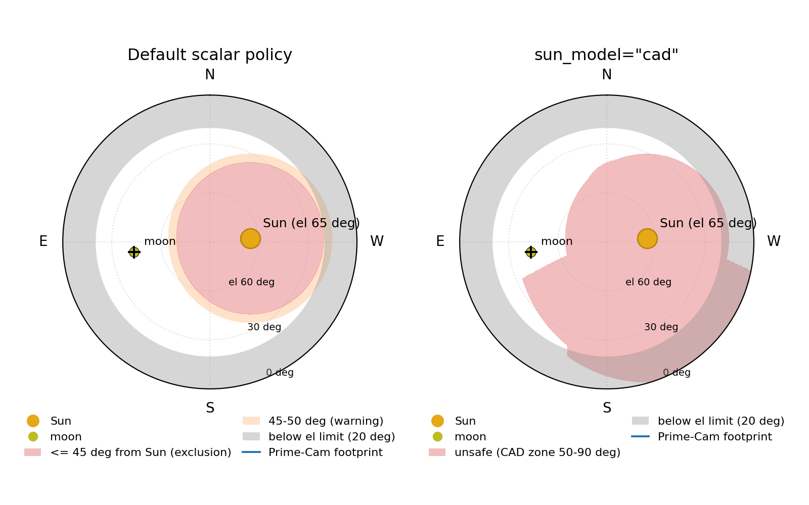

Sun Avoidance
=============

FYST's Sun check is one seam. Every entry point that can care about the
Sun takes the same injectable predicate, so a policy chosen once travels
from visibility reporting through night simulation to the dispatch-time
slew gate. The default everywhere is the site's isotropic exclusion
radius (45°, warning at 50°) and needs no extra install. A position
exactly at the exclusion radius counts as unsafe.

Is my target sun-safe?
----------------------

The fastest answer uses the default policy::

    from astropy.time import Time

    from fyst_trajectories import check_observability

    reports = check_observability(
        ["jupiter", "moon"], Time("2027-01-05T04:00:00", scale="utc")
    )
    for r in reports:
        print(r.name, r.sun_clear, f"{r.sun_separation_deg:.1f} deg")
    # jupiter True 138.4 deg
    # moon False 29.1 deg

``sun_separation_deg`` is always the geometric separation, whichever
policy produced the verdict; the Sun result is also folded into
``r.observable`` and ``r.reasons`` as ``SUN_TOO_CLOSE``. See
:doc:`api/observability` for the full report, observability windows, and
the separate caller-specified bright-source avoid list.

Choosing a policy
-----------------

Three models, one constructor
(:func:`~fyst_trajectories.sun_models.make_sun_safe`). The scalar model
is built in; the other two bind the observatory's shared
`ccatobs/sun-avoidance <https://github.com/ccatobs/sun-avoidance>`_
library, the common home of FYST's Sun-zone geometry:

- ``"scalar"``: the site's isotropic exclusion radius (45°, warning 50°,
  from ``site.sun_avoidance``). The default wherever ``sun_safe`` or
  ``sun_model`` is omitted, and it needs nothing beyond fyst-trajectories.
  Omitting ``slew_safe`` in ``plan_transition`` or ``plan_escape`` sweeps
  the direct path with whichever point model is in play, but
  ``choose_encoder_solution`` has no path default: without ``slew_safe``
  it screens the goal position only.
- ``"cone"``: the shared library's isotropic cone at any radius you name.
- ``"cad"``: the same library's directional CAD-derived zone. The minimum
  Sun separation runs 50-90° with the Sun's direction in the mount frame,
  which is FYST's own hardware model. Opt-in today, and expected to
  become the FYST default in a future release.

Both library-backed models take padding knobs that tighten the verdict,
``maxoffset=`` and ``tracking_module=``; see :doc:`api/sun_models`. The
library itself is an optional dependency, not bundled while the scalar
model is the default; requesting ``"cone"`` or ``"cad"`` without it
raises, naming the pinned revision:

.. code-block:: bash

    pip install "git+https://github.com/ccatobs/sun-avoidance@e6fa12aa53ce5f5f76d50f8b753e7fe4b4ad8e18"

That repository is CCAT-internal, so the command requires collaboration
access.

The scalar radius is an observing policy: at 45° it is more permissive
than the CAD model in every direction, since that model requires
50-90°. Choose ``"cad"`` explicitly
when a scan needs mirror-illumination protection rather than the
observing baseline. Called without a model,
:func:`~fyst_trajectories.sun_models.make_sun_safe` and
:func:`~fyst_trajectories.sun_models.make_slew_safe` build the CAD zone;
the scalar is the default only where no predicate is injected at all.

The models disagree wherever the directional zone exceeds the scalar
radius::

    from astropy.time import Time

    from fyst_trajectories.sun_models import make_sun_safe

    t = Time("2026-11-15T20:30:00", scale="utc")  # Sun at az 261, el 31
    models = (
        make_sun_safe("scalar"),
        make_sun_safe("cone", radius=50.0),
        make_sun_safe("cad"),
    )
    for model in models:
        print(model.describe, model(150.0, 45.0, t))
    # scalar 45 deg       True
    # cone 50 deg         True
    # CAD zone 50-90 deg  False

When the Sun is high, the zone becomes an elevation cap
-------------------------------------------------------

An exclusion radius around a nearly-overhead Sun covers *every* azimuth
above some elevation. The largest possible separation between a point at
elevation ``el`` and the Sun at elevation ``sun_el`` is the arc over the
zenith, ``180 - el - sun_el`` degrees; once ``el >= 180 - radius - sun_el``,
no azimuth is safe. FYST's latitude sits within half a degree of the
solstice solar declination, so around midsummer the Sun transits almost
exactly overhead (``sun_el`` up to about 90°); with the 45° scalar
radius the cap on those days falls to about 45° elevation, barely above
the exclusion radius itself. The example below takes a milder November
afternoon (``sun_el`` about 82°), where the cap sits near 53°::

    from astropy.time import Time

    from fyst_trajectories import Coordinates, get_fyst_site

    coords = Coordinates(get_fyst_site())
    t = Time("2026-11-15T16:45:00", scale="utc")  # Sun at el 82
    print(bool(coords.is_sun_safe(az=90.0, el=60.0, obstime=t)))  # False
    print(bool(coords.is_sun_safe(az=90.0, el=40.0, obstime=t)))  # True

At elevation 60° here, *every* azimuth returns ``False``, not just the
Sun-facing ones. The cap is a property of any radius-style policy,
scalar or cone alike, and the directional CAD zone behaves the same way
at its larger per-direction minima. It lifts as the Sun descends.

Planning a night
----------------

Over a horizon, the injected policy shapes the observable windows (here:
how many of the next 24 hours three bodies are observable under the CAD
policy)::

    from astropy.time import Time

    from fyst_trajectories import check_observability
    from fyst_trajectories.sun_models import make_sun_safe

    sun_safe = make_sun_safe("cad")
    reports = check_observability(
        ["jupiter", "uranus", "moon"],
        Time("2026-11-15T16:00:00", scale="utc"),
        horizon_hours=24.0,
        sun_safe=sun_safe,
    )
    for r in reports:
        print(r.name, r.sun_clear, f"{r.total_observable_hours:.1f} h")
    # jupiter True 2.7 h
    # uranus True 7.4 h
    # moon True 10.0 h

For the Gantt view of those windows (one bar lane per target), see
:func:`~fyst_trajectories.visualization.plot_observability_windows` in
:doc:`api/visualization`.

The offline overhead simulator takes the same predicate through
``generate_timeline(sun_safe=)``: it drives the patch-selection Sun
constraint (unless an explicit ``constraints`` list replaces it), the
mid-scan duration clips, the slew gate and the escape move. The duration
clips cut a science scan short rather than run it into the zone: a
constant-elevation scan is checked across the whole azimuth corridor it
sweeps, turnarounds included, at the scan elevation, and a pong or daisy
scan along its field centre. See :doc:`overhead_quickstart` for the
simulator itself.

Gating a slew at dispatch
-------------------------

Dispatch is the one place the Sun check raises instead of warning. A
correct point predicate is invariant under ``az -> az + 360`` (the same
sky direction), so it can never *choose* an azimuth wrap; the two wraps
differ in the path swept between them, and that is a path question,
answered by sweeping the point model along the trapezoidal slew
(:func:`~fyst_trajectories.sun_models.make_slew_safe`)::

    from astropy.time import Time

    from fyst_trajectories import get_fyst_site, rewrap_trajectory_azimuth
    from fyst_trajectories.dispatch import choose_encoder_solution
    from fyst_trajectories.sun_models import make_slew_safe, make_sun_safe

    t = Time("2026-11-15T20:30:00", scale="utc")
    # From the current pose (az 65, el 45) to the scan's first sample (100, 45).
    solution = choose_encoder_solution(
        65.0, 45.0, 100.0, 45.0, t, get_fyst_site(),
        sun_safe=make_sun_safe("cad"), slew_safe=make_slew_safe("cad"),
    )
    # trajectory: the planned scan. Shift it onto the chosen wrap, then
    # command the slew to (solution.az, solution.el) and POST the result.
    commanded = rewrap_trajectory_azimuth(trajectory, solution.az_shift)

When no wrap has a clear direct path, dispatch raises
``EncoderSolutionError`` rather than rerouting. A caller who wants a
two-leg detour plans it explicitly with
:func:`~fyst_trajectories.sun_models.find_sun_safe_detour`, which tries a
single intermediate point at the azimuth midpoint and returns ``None``
when no elevation there clears both legs. FYST's zones span most of the
elevation range, so the wrap choice above, or waiting, is often the real
recourse. See :doc:`api/dispatch`.

Seeing the zone
---------------

One call draws the whole sky with the zone shaded to the policy's own
boundary, the contour where the Sun separation meets the separation the
policy requires, so the directional zone renders its true asymmetric shape
instead of a circle::

    from astropy.time import Time

    from fyst_trajectories.visualization import plot_sky_view

    fig = plot_sky_view(
        Time("2026-11-15T18:00:00", scale="utc"),
        sun_model="cad",
        boresight="moon",
        show=False,
    )
    fig.savefig("sky_view_cad.png", dpi=140, bbox_inches="tight")

      Moon: a round 45° exclusion zone and 50° warning ring around the Sun on
      the left, a larger asymmetric CAD zone on the right.
   :width: 100%

   That instant under the default scalar policy (left) and under
   ``sun_model="cad"`` (right), zenith at the centre and east to the left.
   The scalar zone is the 45° circle with its 50° warning ring; the CAD
   zone excludes more sky, in a shape set by where the Sun sits in the
   mount frame.
   Each edge is contoured from the Sun separation against the separation
   its policy requires, so neither follows the evaluation grid.

For a whole night rather than an instant,
``plot_visibility(..., sun_model="cad")`` overdraws each target where
the policy marks it unsafe and adds a per-target minimum-separation
curve. Both require the ``plotting`` extra. See :doc:`api/visualization`.

Where the check runs
--------------------

.. list-table::
   :header-rows: 1
   :widths: 45 55

   * - Entry point
     - What it does
   * - ``TrajectoryBuilder(...).build()``
     - Nothing. The low-level pattern path runs no Sun check and will
       point at the Sun; screen the result with
       ``validate_sun_avoidance``, or plan through a ``plan_*_scan``.
   * - ``plan_*_scan(..., sun_safe=)``
     - Pre-flight on the field (or horizon) center at the start time.
       ``plan_constant_el_scan`` additionally sweeps the whole resolved pass
       at the commanded azimuth envelope, and re-checks the center at the
       resolved start when ``lsa_window`` delays it.
       ``plan_pong_altaz_scan`` and ``plan_daisy_altaz_scan`` additionally
       screen the built trajectory over the whole block: every sample when
       ``sun_safe`` is omitted, about 600 evenly spaced samples, both ends
       included, with an injected model. Warns (``PointingWarning``), never
       refuses.
   * - ``plan_source_ces(...)`` and its siblings
     - Pre-flight sweep along the resolved arc (subsampled in time; at the
       midpoint and both edges of the commanded azimuth envelope, which is
       the throw widened by the turnaround overshoot). Warns, never refuses.
   * - ``validate_sun_avoidance(site, az, el, times, sun_safe=)``
     - Samples the trajectory about every 60 s, so a fast scan can cross
       the zone between samples unseen. Warns once: at or inside the
       exclusion radius, otherwise inside the warning radius (an injected
       predicate has no warning band). Advisory only.
   * - ``check_observability(..., sun_safe=)``
     - Reports ``sun_clear`` and ``SUN_TOO_CLOSE``. Never raises.
   * - ``generate_timeline(..., sun_safe=)``
     - The offline night simulator. Excludes unsafe patches, clips
       scans that would run into the zone, refuses a slew whose direct
       path crosses it (the tick idles, labelled with the refusal, and
       the patch is retried once the Sun has moved), and moves a
       telescope the zone has overtaken while parked out of it before
       anything else happens there.
   * - ``plan_transition(..., sun_safe=, slew_safe=, hold=)``
     - Planning. Chooses the wrap and prices the slew; a refusal is a
       typed ``cause`` on the returned transition, never raised. With
       ``hold`` the goal must also stay clear for that long after
       arrival, so a pose the telescope would have to abandon is refused
       before it is commanded.
   * - ``plan_escape(..., sun_safe=, slew_safe=)``
     - Planning. The move out of the zone for a pose it has overtaken:
       the path may start unsafe but never goes more than half a degree
       deeper into the zone than it started, and ends safe; ``None`` when
       the pose is safe, ``no_escape`` when the
       zone holds the telescope. Depth is measured against the model's
       own required separation when it reports one, so a directional
       zone is not judged by raw Sun distance.
   * - ``choose_encoder_solution(..., sun_safe=, slew_safe=)``
     - Dispatch. Raises ``EncoderSolutionError`` when no azimuth wrap has a
       clear goal position or, with ``slew_safe``, a clear direct path; its
       ``cause`` names which. Without ``slew_safe`` the path is not checked.
   * - ``get_fyst_site(sun_exclusion_radius=..., sun_warning_radius=...)``
     - Overrides the scalar radii; ``sun_avoidance_enabled=False``
       disables the check entirely (tests and engineering only).

Downstream, the telescope control system range-checks commanded position
and velocity but not Sun geometry; the Sun interlock is an ACU function
(see "Scope and boundaries" in :doc:`index`). Nothing in this library is an
interlock.

See also
--------

- :doc:`api/sun_models` - the module reference.
- :doc:`api/observability` - reports, windows, and avoid zones.
- :doc:`api/dispatch` - the encoder-choice gate.
- :doc:`api/visualization` - visibility curves and the all-sky view.
