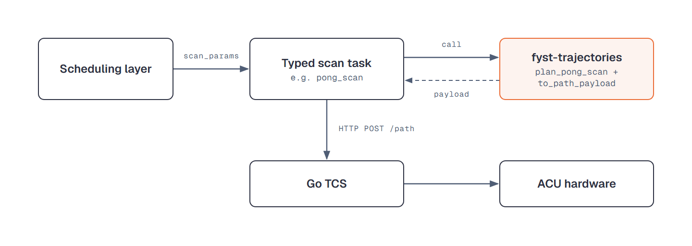

Trajectory Generation Examples
==============================

Examples for generating telescope trajectories using the patterns package.
Trajectories serialize to the Go TCS ``/path`` request body and to ACU
ProgramTrack ``TrackPoint`` rows.

Trajectories are vacuum (unrefracted) az/el unless an atmosphere is
passed, because refraction is applied downstream; see
:ref:`quickstart-planning-refraction`.

The ``Trajectory`` Object
-------------------------

Pattern generation returns a ``Trajectory``: the sampled ``times``, ``az``
and ``el`` with their velocities, an absolute ``start_time``, a per-sample
``scan_flag``, and the pattern metadata. :doc:`api/trajectory` documents
every field, ``science_mask`` and the derived properties.

**Export and inspect** any trajectory built below (the rest of the export
and validation surface is in :doc:`api/trajectory_utils`)::

    from fyst_trajectories.trajectory_utils import print_trajectory, to_path_payload

    # {"start_time": <abs Unix s>, "coordsys": "Horizon",
    #  "points": [[t, az, el, az_vel, el_vel], ...]}
    payload = to_path_payload(trajectory)

    print_trajectory(trajectory)              # First 5 and last 5 points

Sidereal Track
--------------

Track a fixed RA/Dec position::

    from astropy.time import Time

    from fyst_trajectories import get_fyst_site
    from fyst_trajectories.patterns import SiderealTrackConfig, TrajectoryBuilder

    site = get_fyst_site()
    start_time = Time("2026-01-15T02:00:00", scale="utc")

    trajectory = (
        TrajectoryBuilder(site)
        .at(ra=83.633, dec=22.014)  # Crab Nebula
        .with_config(SiderealTrackConfig(timestep=0.1))
        .duration(300.0)
        .starting_at(start_time)
        .build()
    )

Planet Track
------------

Track solar system bodies using astropy ephemeris::

    from astropy.time import Time

    from fyst_trajectories import get_fyst_site
    from fyst_trajectories.patterns import PlanetTrackConfig, TrajectoryBuilder

    site = get_fyst_site()
    start_time = Time("2026-03-15T18:30:00", scale="utc")

    trajectory = (
        TrajectoryBuilder(site)
        .with_config(PlanetTrackConfig(timestep=0.1, body="mars"))
        .duration(600.0)
        .starting_at(start_time)
        .build()
    )

Supported bodies are listed in
:data:`~fyst_trajectories.coordinates.SOLAR_SYSTEM_BODIES`. It
includes ``"sun"``, and the builder runs no Sun check (see
:doc:`sun_avoidance`).

Satellite Track
---------------

Planetary-moon tracking (e.g. Titan) works like planet tracking but
needs a JPL satellite SPK kernel, supplied either on the config or via
the ``FYST_SATELLITE_KERNEL`` environment variable, plus the
``ephemeris`` extra (``jplephem``)::

    from fyst_trajectories.patterns import SatelliteTrackConfig

    config = SatelliteTrackConfig(
        timestep=0.1, body="titan", satellite_kernel="sat441.bsp"
    )

Building the trajectory then follows the planet-track pattern exactly.
Generation raises ``ValueError`` when neither the config nor the
environment names a kernel, ``FileNotFoundError`` when the kernel path
does not exist, and ``ModuleNotFoundError`` without ``jplephem``;
supported names are listed in
:data:`~fyst_trajectories.coordinates.SATELLITE_BODIES`.

Constant Elevation Scan
-----------------------

For field-based observations prefer
:func:`~fyst_trajectories.planning.plan_constant_el_scan`, which
auto-computes the azimuth range, the duration and the number of scans from
the field geometry; :doc:`planning` works it through. For manual control
(engineering tests, known azimuth ranges), drive
``ConstantElScanConfig`` + ``TrajectoryBuilder`` directly::

    from fyst_trajectories import get_fyst_site
    from fyst_trajectories.patterns import ConstantElScanConfig, TrajectoryBuilder

    site = get_fyst_site()

    config = ConstantElScanConfig(
        timestep=0.1,       # Time between points (s)
        az_start=120.0,     # Starting azimuth (deg)
        az_stop=145.0,      # Ending azimuth (deg)
        elevation=45.0,     # Fixed elevation (deg)
        az_speed=1.0,       # Mount-frame az speed (deg/s); on-sky it is x cos(el)
        az_accel=0.5,       # Mount-frame az acceleration (deg/s^2)
    )

    trajectory = (
        TrajectoryBuilder(site)
        .with_config(config)
        .duration(120.0)
        .build()
    )

Pong Scan
---------

A curvy-box raster that fills a rectangular field around a tracked
RA/Dec centre::

    from astropy.time import Time

    from fyst_trajectories import get_fyst_site
    from fyst_trajectories.patterns import PongScanConfig, TrajectoryBuilder

    site = get_fyst_site()
    start_time = Time("2026-03-15T01:00:00", scale="utc")

    config = PongScanConfig(
        timestep=0.1,       # Time between points (s)
        width=2.0,          # Width (deg)
        height=2.0,         # Height (deg)
        spacing=0.1,        # Space between scan lines (deg)
        velocity=0.4,       # Total scan velocity (deg/s)
        num_terms=4,        # Fourier terms for smoothing
        angle=0.0,          # Rotation angle (deg)
    )

    trajectory = (
        TrajectoryBuilder(site)
        .at(ra=180.0, dec=-30.0)
        .with_config(config)
        .duration(600.0)
        .starting_at(start_time)
        .build()
    )

Daisy Scan
----------

A rosette of petals through a single tracked position::

    from astropy.time import Time

    from fyst_trajectories import get_fyst_site
    from fyst_trajectories.patterns import DaisyScanConfig, TrajectoryBuilder

    site = get_fyst_site()
    start_time = Time("2026-01-15T05:00:00", scale="utc")

    config = DaisyScanConfig(
        timestep=0.1,           # Time between points (s)
        radius=0.5,             # Characteristic radius R0 (deg)
        velocity=0.3,           # Scan velocity (deg/s)
        turn_radius=0.2,        # Radius of curvature for turns (deg)
        avoidance_radius=0.0,   # Avoid center radius (0 = pass through)
        start_acceleration=0.5, # Ramp-up acceleration (deg/s^2)
        y_offset=0.0,           # Initial y offset (deg)
    )

    trajectory = (
        TrajectoryBuilder(site)
        .at(ra=83.82, dec=-5.39)  # Orion Nebula
        .with_config(config)
        .duration(300.0)
        .starting_at(start_time)
        .build()
    )

Linear Motion
-------------

Constant velocity motion in Az/El::

    from fyst_trajectories import get_fyst_site
    from fyst_trajectories.patterns import LinearMotionConfig, TrajectoryBuilder

    site = get_fyst_site()

    config = LinearMotionConfig(
        timestep=0.1,           # Time between points (s)
        az_start=100.0,         # Starting azimuth (deg)
        el_start=45.0,          # Starting elevation (deg)
        az_velocity=0.5,        # Az velocity (deg/s)
        el_velocity=0.1,        # El velocity (deg/s)
    )

    trajectory = (
        TrajectoryBuilder(site)
        .with_config(config)
        .duration(60.0)
        .build()
    )

Drift Scan (Planet Calibration)
-------------------------------

A constant elevation scan where a planet drifts through the field of view
due to Earth's rotation.

.. note::

   A first-class planner exists for exactly this:
   :func:`~fyst_trajectories.planning.plan_source_ces` solves the
   crossing geometry, drift rate, and timing for you (and
   ``plan_source_ces_passes`` steps it across the focal plane); see
   :doc:`planning`. To chain such passes over a whole commissioning
   night, see :doc:`overhead_calibration_night`. The example below is
   not that observation: it shows the offset mechanics by hand at
   Jupiter's transit, where the planet's elevation barely changes and
   each azimuth leg sweeps the module across it. ``plan_source_ces``
   refuses an anchor that near transit, because its passes need the
   source's own elevation drift to carry it across the array.

Aim the scan so the planet drifts through one detector module rather
than through the boresight. Drop the offset step to centre it on the
planet itself::

    from astropy.time import Time

    from fyst_trajectories import Coordinates, get_fyst_site
    from fyst_trajectories.offsets import compute_focal_plane_rotation, detector_to_boresight
    from fyst_trajectories.patterns import ConstantElScanConfig, TrajectoryBuilder
    from fyst_trajectories.primecam import get_primecam_offset

    site = get_fyst_site()
    coords = Coordinates(site)
    observation_time = Time("2026-03-15T00:00:00", scale="utc")

    # Get planet position using ephemeris
    planet_az, planet_el = coords.get_body_altaz("jupiter", observation_time)

    # Mechanical (horizon-frame) focal plane rotation
    offset = get_primecam_offset("i1")
    rotation = compute_focal_plane_rotation(el=planet_el, site=site, offset=offset)

    # Compute the boresight position that puts module i1 on the planet
    bore_az, bore_el = detector_to_boresight(
        det_az=planet_az, det_el=planet_el,
        offset=offset,
        focal_plane_rotation=rotation,
    )

    # Set up scan centered on boresight position
    config = ConstantElScanConfig(
        timestep=0.1,
        az_start=bore_az - 5.0,
        az_stop=bore_az + 5.0,
        elevation=bore_el,
        az_speed=0.5,
        az_accel=0.3,
    )

    trajectory = (
        TrajectoryBuilder(site)
        .with_config(config)
        .duration(600.0)
        .starting_at(observation_time)
        .build()
    )

Advanced: Pattern Discovery
---------------------------

When the pattern name is chosen at runtime, go through the registry::

    from astropy.time import Time

    from fyst_trajectories import list_patterns, get_pattern, get_fyst_site

    # List available pattern names
    print(list_patterns())
    # ['constant_el', 'daisy', 'daisy_altaz', 'linear', 'planet', 'pong', 'pong_altaz', 'satellite', 'sidereal']

    # Get a pattern class by name (useful for plugins or config-driven selection)
    pattern_name = "pong"  # e.g., from user input or config file
    PatternClass = get_pattern(pattern_name)

    # Instantiate and generate
    from fyst_trajectories.patterns import PongScanConfig

    site = get_fyst_site()
    start_time = Time("2026-03-15T01:00:00", scale="utc")
    config = PongScanConfig(
        timestep=0.1, width=2.0, height=2.0, spacing=0.1,
        velocity=0.4, num_terms=4, angle=0.0,
    )
    pattern = PatternClass(ra=180.0, dec=-30.0, config=config)
    trajectory = pattern.generate(site, duration=300.0, start_time=start_time)

Dispatching to the Telescope
----------------------------

At the observatory a typed scan task calls a planner at dispatch time,
so the ephemeris is fresh, and POSTs the result to the Go TCS:

      pong_scan. The task calls fyst-trajectories (plan_pong_scan and to_path_payload),
      which returns the payload; the task sends it by HTTP POST to /path to the Go TCS,
      which drives the ACU hardware.
   :width: 100%

   One scan from scheduling to hardware. The typed scan task calls this
   library, the highlighted step, for the payload and POSTs it to the Go TCS.

The dispatch-time API is :doc:`api/dispatch` and
:doc:`api/trajectory_utils`.

For local testing, POST the payload directly. The start time must lead
the Go TCS clock by about 10 seconds, and only an AltAz-frame trajectory
can simply be re-anchored, because its az/el do not depend on when it
runs; a celestial one must be built again at the new time. Nothing here
checks the Sun, so screen anything bound for a real antenna with
``validate_sun_avoidance``::

    import dataclasses

    import astropy.units as u
    import requests
    from astropy.time import Time

    from fyst_trajectories import get_fyst_site
    from fyst_trajectories.patterns import ConstantElScanConfig, TrajectoryBuilder
    from fyst_trajectories.trajectory_utils import to_path_payload

    engineering = (
        TrajectoryBuilder(get_fyst_site())
        .with_config(ConstantElScanConfig(
            timestep=0.1, az_start=120.0, az_stop=145.0, elevation=45.0,
            az_speed=1.0, az_accel=0.5,
        ))
        .duration(120.0)
        .build()
    )
    live = dataclasses.replace(engineering, start_time=Time.now() + 15 * u.s)
    response = requests.post(
        "http://localhost:5600/path", json=to_path_payload(live)
    )
